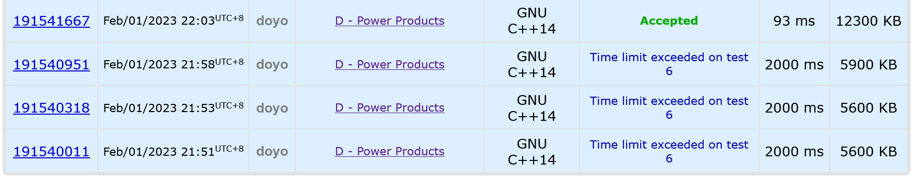
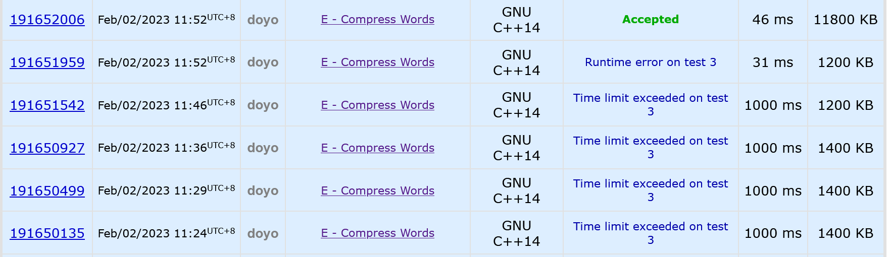
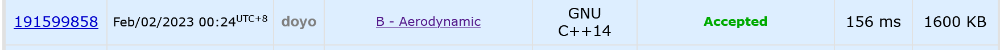
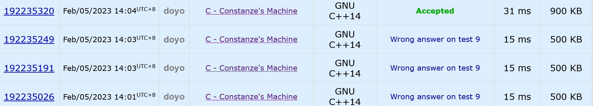
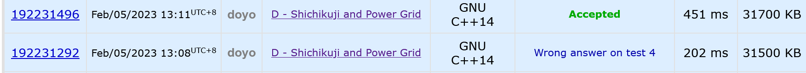
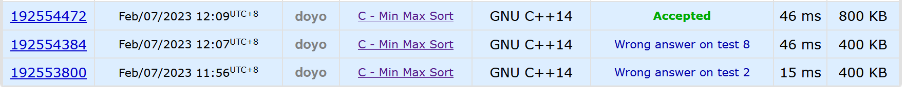
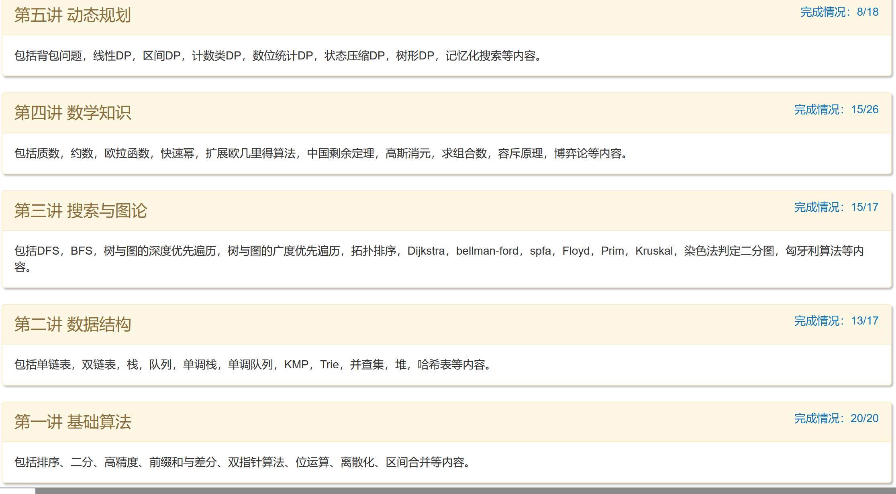

### 概况

除了寒假的DP集训之外，去新生训练把基础巩固了一下

自己训练的话比较懒，把上个学期周赛队友做出来,有思路但我没补的题补了一下.

最后怒刷div4找自信

### CF1225D



题意：

给定$n$个正整数和一个正整数$k$，求出有多少组$(i,j)$满足$a_i*a_j=x^k$

思路：质因数分解+字符串哈希

将每个数的分解后对应质因数的质数对k取模，求哈希值，在哈希表中查找有无与其互补的值即可

```cpp
#include<bits/stdc++.h>
using namespace std;
const long long maxn=2e5+5;
const long long base=131;
const long long mod=1e9+7;
bool st[maxn];
long long prime[maxn],tot,a[maxn],ans,p[maxn],pid[maxn];
long long read()
{
	register long long num=0;
	register char ch=getchar();
	while('0'<=ch&&ch<='9')
	{
		num=num*10+ch-'0';
		ch=getchar();
	}
	return num;
}
void make_prime(long long n)
{
	for(long long i=0;i<=n;i++) st[i]=true;
	st[0]=st[1]=false;
	for(long long i=2;i<=n;i++)
	{
		if(st[i]) prime[++tot]=i,pid[i]=tot;
		for(long long j=1;prime[j]<=n/i;j++)
		{
			st[prime[j]*i]=false;
			if(i%prime[j]==0) break;
		}
	}
}
unordered_map<long long,long long>mp;
int main()
{
	long long n,k;
	n=read();k=read();
	for(long long i=1;i<=n;i++) a[i]=read();
	make_prime(100000);
	p[0]=1;
	for(long long i=1;i<=tot;i++)
		p[i]=p[i-1]*base;
	for(long long i=1;i<=n;i++)
	{
		long long temp=a[i],hashed=0,mated=0,cnt=0;
		for(long long j=1;j<=tot;j++)
		{
			if(prime[j]>temp/prime[j]) break;
			if(temp%prime[j]) continue;
			long long powers=0;
			while(temp%prime[j]==0) powers++,temp/=prime[j];
			powers%=k;
			hashed+=p[j]*powers;
			if(powers) mated+=p[j]*(k-powers);
		}
		//printf("hashed=%lld mated=%lld\n",hashed,mated);
		if(st[temp]) hashed+=p[pid[temp]],mated+=p[pid[temp]]*(k-1);
		ans+=mp[mated];
		mp[hashed]++;
	}
	printf("%lld\n",ans);
	return 0;
}
```

### CF1225E

题目大意：一个n*m的迷宫，从最左上角走到最右下角，有石头，但是可以推石头，推到边界就推不动，问有多少种方案。

思路：对于能否走到，从两方向分别预处理，设$r[i][j]$为$(i,j)$位置右边的石头数，$d[i][j][1]$为$(i,j)$位置下边的石头数，只需要判断石头数是否大于格子数就可以了

于是设$dp[i][j][0/1]$为走到$(i,j)$下一步向右或向下走能到达终点的方案数。那么就有$dp[i][j][0]=\sum_{k=1}^s(dp[i][j+k][1])$其中s是能把当前列的石头推到墙上的最大格子数,向右也是一样。
然后不能一个一个枚举k,$o(n^3)$,用一个前缀和保存就对了

```cpp
#include<bits/stdc++.h>
using namespace std;
const long long maxn=2005;
const long long mod=1e9+7;
long long dp[maxn][maxn][2],mp[maxn][maxn],r[maxn][maxn],d[maxn][maxn],sumd[maxn][maxn],sumr[maxn][maxn];
long long n,m;
int main()
{
	char ch;
	scanf("%lld%lld",&n,&m);
	for(long long i=1;i<=n;i++)
	{
		scanf("\n");
		for(long long j=1;j<=m;j++)
		{
			scanf("%c",&ch);
			if(ch=='R') mp[i][j]=1;
			if(ch=='.') mp[i][j]=0;
		}
	}
	if(n==1&&m==1)
	{
		if(mp[1][1]) printf("0\n");
		else printf("1\n");
		return 0;
	}
	for(long long i=1;i<=n;i++)
		for(long long j=m;j>=1;j--)
			r[i][j]=r[i][j+1]+mp[i][j];
	for(long long i=1;i<=m;i++)
		for(long long j=n;j>=1;j--)
			d[j][i]=d[j+1][i]+mp[j][i];
	dp[n][m][0]=dp[n][m][1]=sumd[n][m]=sumr[n][m]=1;
	for(long long i=n;i>=1;i--)
		for(long long j=m;j>=1;j--)
		{
			if(i==n&&j==m) continue;
			dp[i][j][0]=(sumd[i+1][j]-sumd[n-d[i+1][j]+1][j])%mod;
			dp[i][j][1]=(sumr[i][j+1]-sumr[i][m-r[i][j+1]+1])%mod;
			sumr[i][j]=(sumr[i][j+1]+dp[i][j][0])%mod; 
			sumd[i][j]=(sumd[i+1][j]+dp[i][j][1])%mod; 
		}
	printf("%lld\n",((dp[1][1][1]+dp[1][1][0])%mod+mod)%mod);
	return 0;
}
```

### CF1200E

题目大意：给定一堆字符串，要求把前一个字符串的后缀跟后一个字符串的前缀相同的最大部分合并

思路:可以求后面的字符串+前面的字符串组成的新串的next数组然后删去next[n]长度即可

写这道题的时候查了半天才发现strlen函数放在循环中的话会T飞……



```cpp
#include<bits/stdc++.h>
using namespace std;
const int maxn=2e6+5;
char s[maxn],merged[maxn];
int ne[maxn],n;
int main()
{
	scanf("%d",&n);
	scanf("%s",merged+1);
	int n1=strlen(merged+1);
	for(int i=2;i<=n;i++)
	{
		scanf("%s",s+1);
		int n2=strlen(s+1),len1=n2;
		int n=min(n1,n2);s[++n2]='@';
		for(int i=1;i<=n;i++) s[++n2]=merged[n1-n+i];
		ne[0]=ne[1]=0;
		for(int i=2,j=0;i<=n2;i++)
		{
			while(j&&s[i]!=s[j+1]) j=ne[j];
			if(s[i]==s[j+1]) j++;
			ne[i]=j;
		}
		for(int i=ne[n2]+1;i<=len1;i++) merged[++n1]=s[i];
	}
	printf("%s\n",merged+1);
	return 0;
}
```

### CF1299B



一道计算几何,学习了一下闵可夫斯基和，然后做向量可以看出，题目是求所给的图形是否为中心对称图形

```cpp
#include<bits/stdc++.h>
using namespace std;
const int maxn=1e5+5;
double x[maxn],y[maxn];
int main()
{
	int n;
	scanf("%d",&n);
	for(int i=1;i<=n;i++)
		scanf("%lf%lf",&x[i],&y[i]);
	if(n&1)
	{
		printf("NO\n");
		return 0;
	}
	int mid=n>>1;
	double centx=(x[1]+x[mid+1])/2,centy=(y[1]+y[mid+1])/2;
	for(int i=2;i<=mid;i++)
	{
		if((x[i]+x[mid+i])/2!=centx||(y[i]+y[mid+i])/2!=centy)
		{
			printf("NO\n");
			return 0;
		}
	}
	printf("YES\n");
	return 0;
}
```

### CF1245C

题目大意：给出一段加密后的密文，已知加密规则是w变成uu,m变成nn，其他字符不变，问原文有多少种可能

思路：关键在于连续的u和n的计算，设$dp[i]$表示方案数很容易得到$dp[i]=dp[i-1]+dp[i-2]$

```cpp
#include<bits/stdc++.h>
using namespace std;
const long long maxn=1e5+5;
const long long p=1e9+7;
long long dp[maxn];
char str[maxn];
int main()
{
	long long ans=1;
	dp[1]=1;dp[2]=2;
	for(long long i=3;i<=maxn-1;i++) dp[i]=(dp[i-1]+dp[i-2])%p;
	scanf("%s",str+1);
	long long n=strlen(str+1);
	long long i,j;
	for(i=1;i<=n&&j<=n;i++)
	{
		j=i;
		if(str[i]=='w'||str[i]=='m')
		{
			printf("0\n");
			return 0;
		}
		if(str[i]=='u')
		{
			while(str[j+1]=='u') j++;
			ans=(ans*dp[j-i+1])%p;i=j;
		}
		else
		{
			if(str[i]=='n')
			{
				while(str[j+1]=='n') j++;
				ans=(ans*dp[j-i+1])%p;i=j;
			}
		}
	}
	printf("%lld\n",ans);
	return 0;
}
```

### CF1245D



题目大意：给定一张无向图，要使得每个城市都有电，支持两种操作，在这个城市上建立一个发电站，或者让他跟一个有发电站的城市连通，建发电站和连电缆的代价都给出，求最小花费

思路，设一个0号节点，0号点剩下每个点的边权都是修发电站的费用，对这个新图跑一遍最小生成树

```cpp
#include<bits/stdc++.h>
#define il inline
#define re register
using namespace std;
typedef long long ll;
const int maxn=2005;
struct Edge
{
	int from;int to;ll dis;
}edge[maxn/2*maxn];
struct node
{
	int from;int to;
};
vector<int> ans_point;
vector<node> ans_line;
int fat[maxn],x[maxn],k[maxn],y[maxn],c[maxn],tot,n;
ll ans;
bool cmp(node x,node y)
{
	if(x.from==y.from) return x.to<y.to;
	else return x.from<y.from;
}
bool cmp1(Edge x,Edge y)
{
	return x.dis<y.dis;
}
il int read()
{
	re int num=0,f=1;
	re char ch=getchar();
	while(ch<'0'||ch>'9')
	{
		if(ch=='-') f=-1;
		ch=getchar();
	}
	while('0'<=ch&&ch<='9')
	{
		num=num*10+ch-'0';
		ch=getchar();
	}
	return num*f;
}
int find(int x)
{
	if(fat[x]==x) return fat[x];
	fat[x]=find(fat[x]);
	return fat[x];
}
il void addedge(int from,int to,ll dis)
{
	edge[++tot].from=from;
	edge[tot].to=to;
	edge[tot].dis=dis;
}
il void kruskal()
{
	int sum=0;
	for(int i=0;i<=n;i++) fat[i]=i;
	sort(edge+1,edge+tot+1,cmp1);
	for(int i=1;i<=tot;i++)
	{
		int f1=find(edge[i].from),f2=find(edge[i].to);
		if(f1!=f2)
		{
			sum++;fat[f1]=f2;
			if(edge[i].from==0) ans_point.push_back(edge[i].to);
			else ans_line.push_back((node){edge[i].from,edge[i].to});
			ans+=edge[i].dis;
			if(sum==n) break;
		}
	}
}
int main()
{
	n=read();
	for(int i=1;i<=n;i++) x[i]=read(),y[i]=read();
	for(int i=1;i<=n;i++) c[i]=read();
	for(int i=1;i<=n;i++) k[i]=read();
	for(int i=1;i<=n;i++)
	{
		addedge(0,i,c[i]);
		for(int j=i+1;j<=n;j++)
			addedge(i,j,(ll)(k[i]+k[j])*(ll)(abs(x[i]-x[j])+abs(y[i]-y[j])));
	}
	kruskal();
	printf("%lld\n",ans);
	sort(ans_point.begin(),ans_point.end());
	printf("%d\n",ans_point.size());
	for(auto item:ans_point) printf("%d ",item);
	printf("\n%d\n",ans_line.size());
	sort(ans_line.begin(),ans_line.end(),cmp);
	for(auto item:ans_line) printf("%d %d\n",item.from,item.to);
	return 0;
}
```

### CF1792C



在排列中任选两个数字，将它们中的最大值插入至队尾，最小值插入至队首,现在给定多个排列，问每个排列最少各需多少次操作才能变得严格递增。

思路：二分+双指针

```cpp
#include<bits/stdc++.h>
using namespace std;
const int maxn=2e5+5;
int n,a[maxn];
bool judge(int x)
{
	int j=x+1;
	for(int i=1;i<=n;i++) 
	{
		if(a[i]==j) 
		{
			if(j==n-x) return true;
			j++;
		}
	}
	return false;
}
int erfen(int l,int r)
{
	while(l<r)
	{
		int mid=l+r>>1;
		if(judge(mid)) r=mid;
		else l=mid+1;
	}
	return l;
}
int main()
{
	int t,ans;
	scanf("%d",&t);
	while(t--)
	{
		scanf("%d",&n);
		for(int i=1;i<=n;i++)
			scanf("%d",&a[i]);
		ans=erfen(0,n>>1);
		printf("%d\n",ans);
	}
	return 0;
}

```

新生训练



一些文档交过了，也还是附上吧
